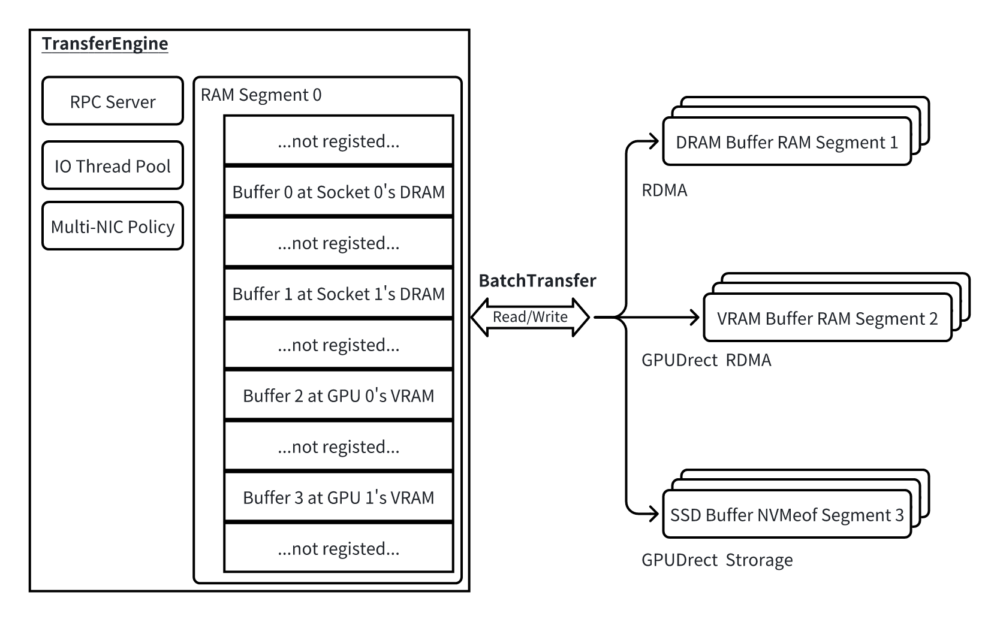

[RDMA](./RDMA.md)

[GDR](./GDR.md)


架构图：




```cpp
// 1. 创建
TransferEngine engine(true);

// 2. 初始化
engine.init(
    metadata_server,
    local_server_name
);

// 3. 注册本地内存
engine.registerLocalMemory(
    buffer,
    size,
    "cuda:0",
    true
);

// 4. 打开远端 Segment
auto target =
    engine.openSegment("worker-B");

// 5. 创建 batch
auto batch =
    engine.allocateBatchID(1);

// 6. 构造传输
TransferRequest req{};

req.opcode        = TransferRequest::WRITE;
req.source        = buffer;
req.target_id     = target;
req.target_offset = remote_addr;
req.length        = size;

// 7. 异步提交
engine.submitTransfer(
    batch,
    {req}
);

// 8. 查询状态
TransferStatus status;

engine.getTransferStatus(
    batch,
    0,
    status
);

// 9. 清理
engine.freeBatchID(batch);
engine.closeSegment(target);

engine.unregisterLocalMemory(
    buffer
);
```

`TransferEngine` 底层会调用 `Transport`

Mooncake 提供了非常多的传输方式：

- TcpTransport
- RdmaTransport
- EfaTransport
- NVMeoFTransport
- NvlinkTransport
- IntraNodeNvlinkTransport
- HipTransport

