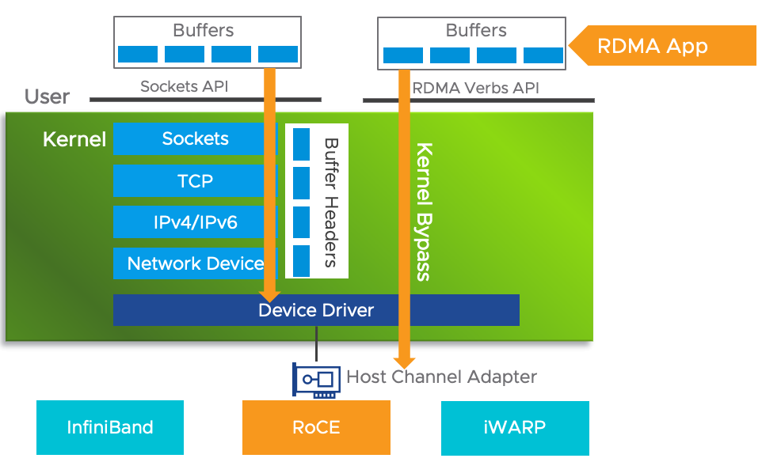
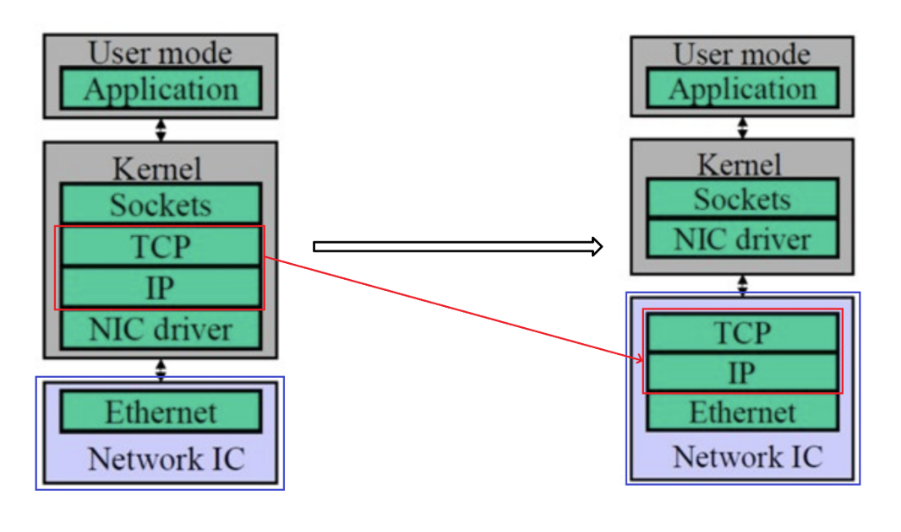
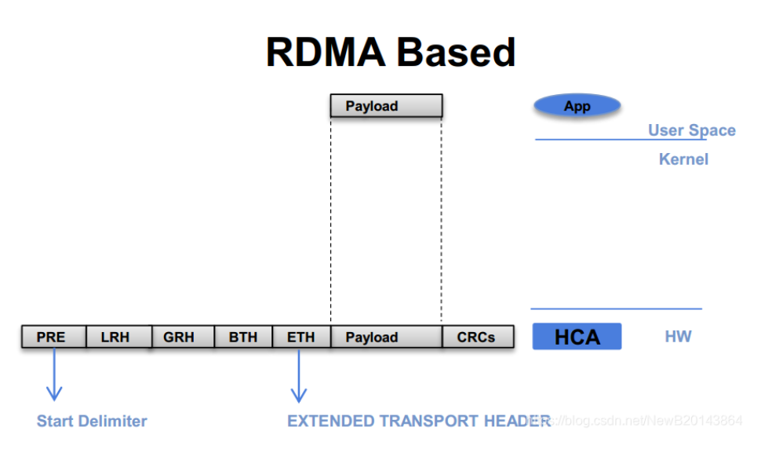
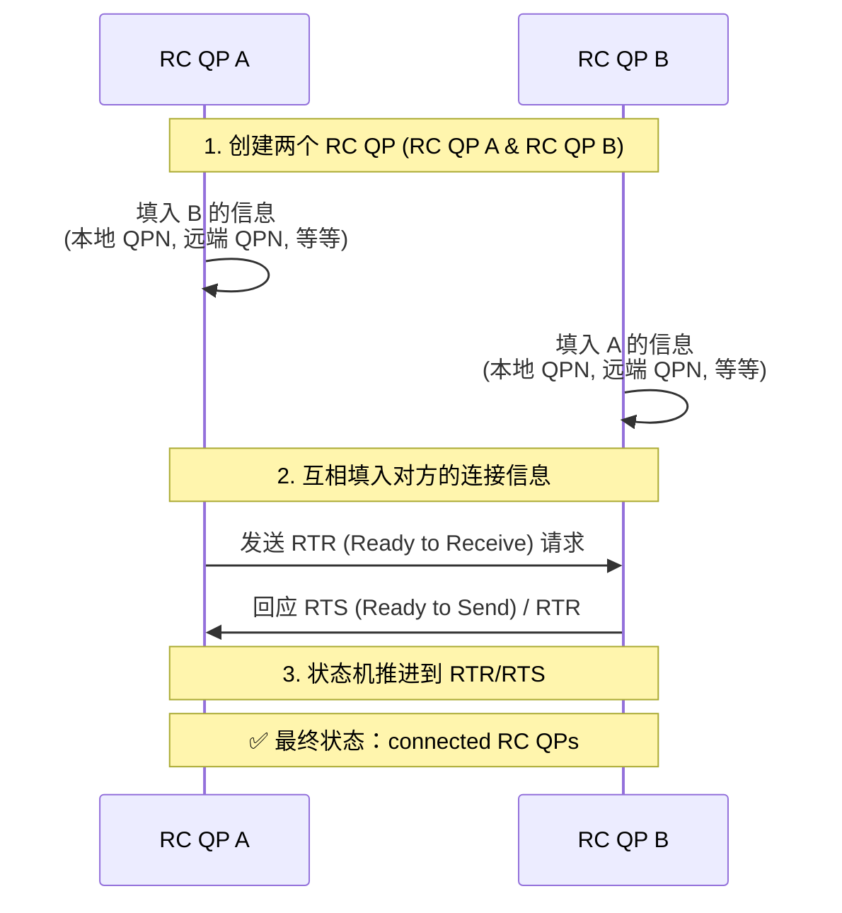
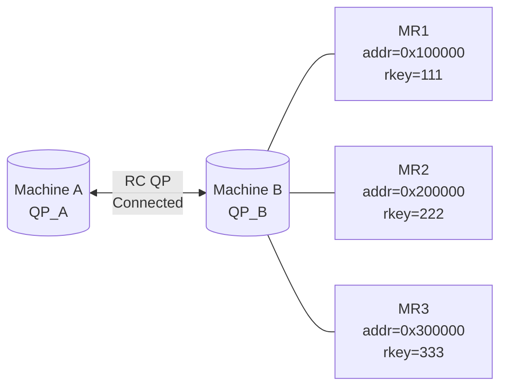
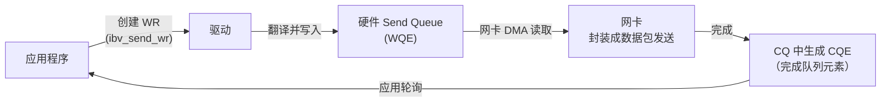
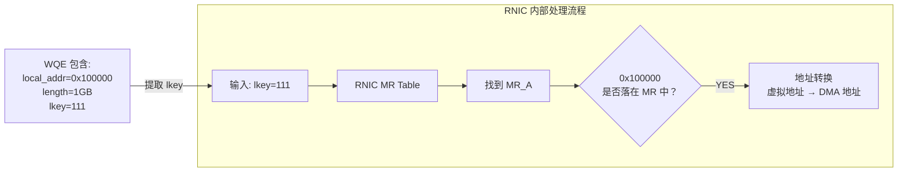
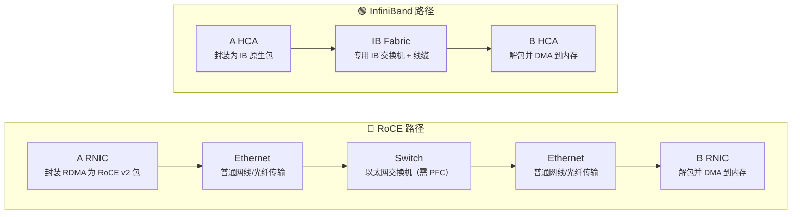

RDMA(Remote Direct Memory Access)，远程直接内存访问。

## 概念



我们来捋一下**传统网络数据**传输需要哪些步骤：

数据发送方：

- 数据从用户空间 Buffer copy 到内核空间的 Socket Buffer
    
- 数据在内核空间中加上了数据包头部，进行数据封装
    
- 最终封装好的数据包从内核 Socket Buffer 通过 DMA 传输到 NIC 发送队列
    

显然上述做法存在很大的网络时延，带来了两个问题：

1. 需要 CPU 多次介入，大量消耗 CPU 性能
    
2. 至少有两次 copy，严重限制了网络带宽
    

其实，超算的硬件是目前地球上计算机的顶配，对应的技术自然也是最先进的，人们早就研究出了所谓的 InfiniBand（无限带宽技术）来优化超算的网络。

我们需要思考的是如何将这种技术用在现在更大规模的网络和 AI 训练推理中。

人们提出了多种方案，我们介绍其中的两种： TOE 和 RDMA

### TOE （TCP/IP 协议处理工作从 CPU 转移到网卡）

这是一种将 TCP/IP 协议处理工作从 CPU 转移到网卡的技术，解决了上面我们提到的问题1。

TOE(TCP Offloading Engine)，在主机通过网络进行的传输的过程中，CPU 需要耗费大量的资源进行多层网络协议的数据包处理，包括数据复制、协议处理和中断处理。为了将 CPU 从这些操作中解放出来，人们发明了 TOE 技术，将上述工作从 CPU 转移到了专门的网卡上。TOE 技术需要特定支持 Offloading 的网卡，这种特定网卡能够支持封装多层网络协议的数据包。



- TOE 技术将原来在协议栈中进行的IP 分片、TCP 分段、重组、checksum 校验等操作，转移到网卡硬件中进行，降低系统 CPU 的消耗，提高服务器处理性能。
    
- 传统的普通网卡处理每个数据包都要触发一次中断，TOE 网卡则让每个应用程序完成一次完整的数据处理进程后才触发一次中断，显著减轻服务器对中断的响应负担。
    
- TOE 网卡在接收数据时，在网卡内进行协议处理，因此，它不必将数据复制到内核空间缓冲区，而是直接复制到用户空间的缓冲区，这种“零拷贝”方式避免了网卡和服务器间的不必要的数据往复拷贝。
    

### RDMA (绕过CPU，数据直接'传'到对端内存)

TOE 技术只支持 TCP/IP 协议栈，为了进一步优化网络，我们需要绕开 TCP，使用一种自己设计的全新的协议，这样更快，在更小的网络范围内可以使得协议栈更精简。

**TOE vs RDMA 对比：**

|特性|传统网络|TOE|RDMA|
|---|---|---|---|
|CPU 参与|高（多次中断+数据拷贝）|低（协议处理卸载到网卡）|极低（完全绕过内核）|
|数据拷贝|至少 2 次|1 次（零拷贝到用户空间）|0 次（直接内存访问）|
|协议栈|TCP/IP|TCP/IP|自定义（IB/RoCE/iWARP）|
|网络要求|通用|通用|部分需要无损网络|
|延迟|高|中|低|
|硬件成本|低|中|高|

RDMA 利用 Kernel Bypass 和 Zero Copy 技术提供了低延迟的特性，同时减少了CPU占用，减少了内存带宽瓶颈，提供了很高的带宽利用率。RDMA提供了给基于 IO 的通道，这种通道允许一个应用程序通过 RDMA 网卡对远程的虚拟内存进行直接读写。

RDMA 技术有以下几个特点：

- CPU Offload：无需 CPU 干预，应用程序可以访问远程主机内存而不消耗远程主机中的任何 CPU。远程主机内存能够被读取而不需要远程主机上的进程（或 CPU)参与。远程主机的 CPU 的缓存(cache)不会被访问的内存内容所填充
    
- Kernel Bypass：RDMA 提供一个专有的 Verbs interface 而不是传统的 TCP/IP Socket interface。应用程序可以直接在用户态执行数据传输，不需要在内核态与用户态之间做上下文切换
    
- Zero Copy：每个应用程序都能直接访问集群中的设备的虚拟内存，这意味着应用程序能够直接执行数据传输，在不涉及到网络软件栈的情况下，数据能够被直接发送到缓冲区或者能够直接从缓冲区里接收，而不需要被复制到网络层。
    

最后的数据包结构如下图所示：



报文结构（从左到右）

- **PRE**：前缀（Start Delimiter），用于标识报文开始。
    
- **LRH**：本地路由头（Local Routing Header），用于本地子网内的路由。
    
- **GRH**：全局路由头（Global Routing Header），用于跨子网的路由。
    
- **BTH**：基础传输头（Base Transport Header），定义 RDMA 操作类型（如读、写、发送）。
    
- **ETH**：以太网帧头（如果 RDMA 运行在以太网之上，即 RoCE 协议）。
    
- **Payload**：要传输的实际数据。
    
- **CRCs**：循环冗余校验码，用于数据完整性校验。
    

其中，`LRH + GRH + BTH + ETH` 合称为 **EXTENDED TRANSPORT HEADER（扩展传输头）**。

RDMA 是一种设计模式，对应着可以有不同的具体的实现，目前主流有三种：

1. InfiniBand(IB): 基于 InfiniBand 架构的 RDMA 技术，需要专用的 IB 网卡和 IB 交换机。从性能上，很明显 Infiniband网络最好，但网卡和交换机是价格也很高。
    
2. RoCE：即 RDMA over Ethernet(RoCE), 基于以太网的 RDMA 技术，也是由 IBTA 提出。RoCE 支持在标准以太网基础设施上使用 RDMA 技术，但是需要交换机支持无损以太网传输，只不过网卡必须是支持 RoCE 的特殊的 NIC。
    
3. iWARP：Internet Wide Area RDMA Protocal，基于 TCP/IP 协议的 RDMA 技术(在现有 TCP/IP 协议栈基础上实现 RDMA 技术,在 TCP 协议上增加一层 DDP)，由 IETF 标准定义。iWARP 支持在标准以太网基础设施上使用 RDMA 技术，而不需要交换机支持无损以太网传输，但服务器需要使用支持 iWARP 的网卡。与此同时，受 TCP 影响，性能稍差。
    

**三种 RDMA 实现对比：**

|特性|InfiniBand|RoCEv1|RoCEv2|iWARP|
|---|---|---|---|---|
|网络层|L2（链路层）|L2（链路层）|L3（UDP/IP）|L4（TCP/IP）|
|路由支持|❌ 仅子网内|❌ 仅子网内|✅ 可路由|✅ 可路由|
|无损网络要求|✅ 需要|✅ 需要|✅ 需要|❌ 不需要|
|性能|最高|高|高|中|
|硬件成本|最高（专用设备）|中（RoCE 网卡）|中（RoCE 网卡）|低（iWARP 网卡）|
|网络环境|专用 IB 网络|以太网|以太网|以太网/广域网|
|适用场景|超算中心|数据中心内部|数据中心/跨机房|广域网/混合云|

显然，IB 技术就是我们上面提到的，用在超级计算机中的，本着只求最强，完全不看性价比，什么都得定制化，所以性能最强，也是实际使用中无法接受的，只能作为一种性能标杆来衡量我们 trade off 的方案的性能怎么样

而 RoCE 可以被认为是 IB 技术的低成本的解决方案，本质上就是显示情况下，基本都是以太网络，我们将协议栈兼容现有的以太网络协议，这样可以更好的直接在我们现有的网络中使用，当然由于为了兼容，肯定要牺牲部分的性能，RoCE协议存在RoCEv1 （RoCE）和RoCEv2 （RRoCE）两个版本，主要区别：

- RoCEv1是在以太网链路层（L2）之上用 IB 网络层代替了 TCP/IP 网络层实现的 RDMA 协议(交换机需要支持PFC等流控技术，在物理层保证可靠传输)，所以不支持IP路由功能。
    
- RoCEv2是使用以太网 TCP/IP 协议中 UDP+IP 作为IB 网络层(L3)实现,基于 TCP/IP协议的网络层(L3)使得 RoCEv2 数据包可以被路由。(也可在三层做 PFC）
    

而 iWARP 显然是为了再更宽泛的现有网络中使用，支持了广域网，同时由于 TCP 协议支持了流量和拥塞控制，因此不需要无损传输，当然性能也是最差的


## 底层实现

线路图：

```
Machine A                                Machine B

Application                              Application
    │                                        │
src_buf                                  dst_buf
0x100000                                 0x800000
    │                                        │
MR_A                                     MR_B
lkey=111                                 rkey=888
    │                                        │
    ▼                                        ▼
 RNIC A ======= RoCE / InfiniBand ======= RNIC B
```

我们希望执行：

```CPP
memcpy_remote(
    A:0x100000,
    B:0x800000,
    1GB
);
```

但实际上一个 **RDMA WRITE** 底层会大致经历：

1. 创建并连接 QP
2. 注册内存
3. 交换 addr + rkey
4. 构造 WR
5. Post WR 到 Send Queue
6. Ring Doorbell
7. RNIC DMA Read A 内存
8. 网络传输
9. B RNIC 收包并校验 rkey
10. B RNIC DMA Write B 内存
11. ACK
12. A RNIC 产生 CQE

下面我们来详细讲讲一次 **RDMA WRITE** 底层具体经历哪些步骤


#### 1. 创建并连接 QP

两边会各创建一个 RC 的 QP（Queue Pair）：

```
Machine A                       Machine B

QP_A                            QP_B
├─ Send Queue                   ├─ Send Queue
└─ Receive Queue                └─ Receive Queue
└─ transport state context      └─ transport state context
```

RC 的 QP 需要建立逻辑连接，并维护可靠、有序传输所需的状态。

QP = 通信端点 / 工作队列资源

RC = 这个 QP 采用的一种传输语义

QP 定义的是这次通信需要传的任务有哪些，而具体怎么传，用哪套传输语义传，可以有多种。就像我们有发送和接受网络包时，可以选择 TCP or UDP 来传，RDMA 中也有多种 transport type，比如：
- RC = Reliable Connection
- UC = Unreliable Connection
- UD = Unreliable Datagram

> [!NOTE]
> 这里 RDMA 中的概念其实可以用 TCP 来进行类比，虽然不完全等价
> QP ≈ Socket， RC ≈ TCP
> 
> RDMA：
>- 创建 QP
>- 指定类型为 RC
>
> TCP:
> - 创建 Socket
> - 指定类型为 SOCK_STREAM（TCP）


创建 RC 的 QP 用代码来表示就是：

```cpp
ibv_qp_init_attr attr{};
attr.qp_type = IBV_QPT_RC;  // 指定类型为 RC

ibv_qp* qp = ibv_create_qp(pd, &attr);
```

两边都各自创建好 QP 后，下面就需要连接两边的 QP，来建立 QP 连接了

RC 的 QP 需要建立逻辑连接，并维护可靠、有序传输所需的状态:

$$
\text{RESET} \to \text{INIT} \to \text{RTR（Ready To Receive）} \to \text{RTS（Ready To Send）}
$$

要进入到 RTR / RTS，A 和 B 之间需要知道对方的一些基本的连接信息，然后写入各自 QP 的 transport state context 中，如：
- QPN（QP_ID）
- GID / LID
- PSN
- ...

这些东西通常通过一个**控制面通道**交换，如
- TCP
- RDMA CM
- RPC
- etcd
- ...

> [!NOTE]
> 所以 RDMA 本质上并不是完全没有传统的网络通信，就像也不是完成不需要 CPU 进行参与，在建立连接等准备工作期间还是会用到的，只是后续的数据传输走的是 RDMA DMA

状态到 RTR / RTS 后才可以说两个 RC 的 QP 构建了一条 RC Communication Relationship

整体的状态流转可以理解为：



#### 2. 注册内存

两边分别注册内存：

```cpp
ibv_reg_mr(pd, buf, size, flags)
```

Memory Registration 会把这块 buffer 变成 RNIC 安全 DMA 的 **MR**(Memory Region)，并产生 `lkey` 和 `rkey`。

MR 主要的作用是：

- 地址翻译：获得一个 DMA mapping，负责根据传入的虚拟地址来找到实际的 physical pages
- 内存稳定性：锁住物理页防止被换出[^1]。
- 权限保护：定义这一块 MR 是否可以被本地 `IBV_ACCESS_LOCAL_WRITE`，以及远端 `IBV_ACCESS_REMOTE_WRITE` or `IBV_ACCESS_REMOTE_READ` 等

底层实际注册的链路大概是：

```
你的 C++ 程序
      │
      │ ibv_reg_mr()
      ▼
libibverbs / provider
      │
      ▼
Linux RDMA subsystem
      │
      ▼
具体 RNIC driver
例如 mlx5_ib
      │
      ├─ 处理用户虚拟地址
      ├─ 获取 / 固定对应 memory pages
      ├─ 建立 DMA mapping
      ├─ 建立 RNIC translation/protection entry
      └─ 配置 RNIC hardware
              │
              ▼
            RNIC
```

最后返回：

```cpp
struct ibv_mr {
    void*    addr;
    size_t   length;
    uint32_t lkey;
    uint32_t rkey;
};
```

这里返回的：

- `lkey`：本地 RNIC 访问 local memory 时使用的 key
- `rkey`：供给远端 RDMA 操作访问该 MR

主要是用于身份凭证，毕竟直接修改内存是一件很危险的事情，所以要做好安全校验。每一块 MR 内存区域都需要有专门的注册后的 key，因为虽然我可能允许你进行通信，但是想做更细粒度的权限管控，比如只允许你修改某些 MR。

#### 3. 交换 addr + rkey

交换 addr 和 rkey 是为了后面组装 WQE，WQE 里面需要写明实际要 Read or Write 的位置和那一块 MR 的 rkey 信息。


我们区分一下这几个概念，它们各自的作用不同：

|     | 职责                | 作用                |
| --- | ----------------- | ----------------- |
| QP  | 数据包往哪台机器的哪个 QP 发送 | 解决的是如何保证顺序、ACK、重传 |
| WQE | 这一次具体执行什么操作       |                   |
| MR  | 这一次具体访问远端哪块内存     |                   |

#### 4. 构造 WR

有了上面的控制信息的交互后，我们就可以尝试实际发起 **WR**（Work Request，工作请求）了：

```cpp
struct ibv_sge sge;

sge.addr   = 0x100000;
sge.length = 1GB;
sge.lkey   = 111;


struct ibv_send_wr wr;

wr.opcode = IBV_WR_RDMA_WRITE;

wr.sg_list = &sge;

wr.wr.rdma.remote_addr = 0x800000;
wr.wr.rdma.rkey        = 888;
```


#### 5. Post WR 到 Send Queue

刚刚的 WR 是我们软件 API 构造的对象，是**应用程序/用户侧**看到的“任务描述”

我们需要将 WR 转换成硬件能识别消费的 **WQE**（Work Queue Element，工作队列元素）。

通过调用 `ibv_post_send(qp, &wr, ...)` 就可以将 WR 提交为 Send Queue 中的一个 WQE

整体流程大概是：



#### 6. Ring Doorbell

将 WQE 写入 Send Queue 后，我们还需要显示地通知 RNIC 进行消费 WQE，这个动作就被称为 *Ring Doorbell*


#### 7. RNIC DMA Read A 内存

RNIC 消费一个 RDMA WRITE 的 WQE，会先去处理本地需要 send 的数据。

根据 lkey 去找到对应的 MR，然后判断这次请求是否合法：

- 地址是否合法
- 这块 MR 是否可以支持这种操作

以及读取 DMA mapping 来获取实际 DMA 的物理 page 地址



处理完上面的，接下来才开始实际搬数据

大块的 payload 的搬运由 NIC DMA engine 完成

当然大块的数据不可能一个网络包就传完，RNIC 会自动切成多个包进行传输：

```
QP
 ↓
packet sequence number
 ↓
PSN 100
PSN 101
PSN 102
...
```

当然硬件会 pipeline，并不是傻乎乎完全串行发送这些 packet


#### 8. 网络传输

根据不同的协议，网络传输的链路也会不同



这里的网络协议的包装和处理由 CPU 转移到了 RNIC 硬件


#### 9. B RNIC 收包并校验 rkey

同样的 B 的 RNIC 接收到包后，解析后得到：

```
QP = xxx
opcode = RDMA WRITE
rkey = 888
remote_addr = 0x800000
```

然后找到对应的 MR 进行一些校验和判断，和之前的步骤 7 中类似


#### 10. B RNIC DMA Write B 内存

检验通过后，就可以直接进行 DMA Write 了

这里的 payload 会直接被写入到实际的物理页中


#### 11. ACK

RC 是 reliable transport

B 再收到包并写完后，会给 A 的 RNIC 回复 ACK 的信号

这样的话如果丢包， A 的 RNIC 也会知道哪些需要重传


#### 12. A RNIC 产生 CQE

等刚刚的所有的 packet 都 ACK 后，A 的 RNIC 会往 Completion Queue 写入一个 CQE（Completion Queue Entry）。

之后我们在应用侧就可以通过 `ibv_poll_cq()` 看到状态

CQ 的作用就是保存完成的 WR 对应的 CQE，这时候我们轮询或者事件式处理这个状态信息就可以进行监听


[^1]: 当然现在还有 ODP（On-Demand Paging）之类的机制，可以不要求传统意义上一开始全部 pin 住，但那属于更高级的优化